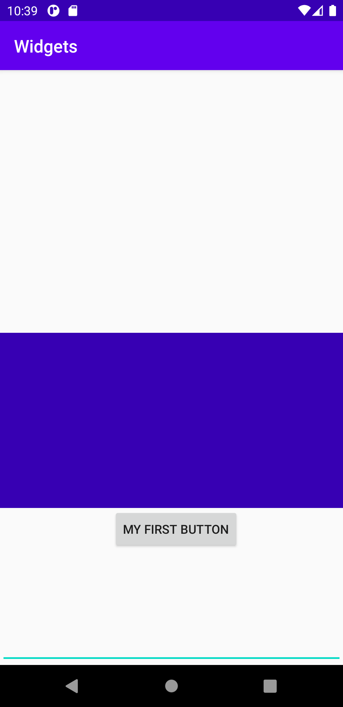

# Rapport

Jag började med att gå in i layout mappen, Sedan använde jag mig av den existerande layoutfilen "activity_main" och ändrade i koden.
Jag tog bort den existerande koden och la in ny kod för contraint layout.
```
<?xml version="1.0" encoding="utf-8"?>
<androidx.constraintlayout.widget.ConstraintLayout xmlns:android="http://schemas.android.com/apk/res/android"
```

Som första widget skapade jag en knapp. Knappen är bunden till undersidan min bild som blev min andra widget. Det som kan vara värt att notera här är att jag har anävnder mig av
"wrap_content" Detta gör så att knappen inte tar upp mer än sin egen storlek. Sedan har jag flyttat min knapp 10dp åt höger.

```

    <Button
        android:id="@+id/myNewBtn"
        android:layout_width="wrap_content"
        android:layout_height="wrap_content"
        android:layout_marginLeft="10dp"
        android:text="@string/my_first_button"
        app:layout_constraintRight_toRightOf="parent"
        app:layout_constraintLeft_toLeftOf="parent"
        app:layout_constraintTop_toBottomOf="@+id/imageView"
         />
```

Bild

Jag har valt att gå med en existerande bild från programet. Jag har använt mig av "match_parent" för att bilden ska blir lika bred som skrämen och sedan sagt att den ska vara 200dp lång.
Content discription har jag satt till bild om den inte skulle laddas. Jag har sedan yttligare flyttat ner bilden 300dp från top.

```
   <ImageView
        android:id="@+id/imageView"
        android:layout_width="match_parent"
        android:layout_height="200dp"
        android:layout_marginTop="300dp"
        android:adjustViewBounds="false"
        android:contentDescription="bild"
        app:layout_constraintTop_toTopOf="parent"
        app:layout_constraintRight_toRightOf="parent"
        app:layout_constraintLeft_toLeftOf="parent"
        android:src="@color/colorPrimaryDark"
        />
```

EditText

Jag satt bredden till att vara lika bred som skärmen. Sedan har jag sagt att den ska vara 40dp lång.
Jag har sedan valt att placera min text i botten. Jag har här inte ändrat något i margin till skäl av att det ser redan bra ut.

```
  <EditText
        android:id="@+id/myText"
        android:layout_width="match_parent"
        android:layout_height="40dp"
        app:layout_constraintBottom_toBottomOf="parent"
        app:layout_constraintStart_toStartOf="parent"
        android:hint="@string/type_here"
        />
```


Bild på slut resultatet.

  


_Du kan ta bort all text som finns sedan tidigare_.

## Följande grundsyn gäller dugga-svar:

- Ett kortfattat svar är att föredra. Svar som är längre än en sida text (skärmdumpar och programkod exkluderat) är onödigt långt.
- Svaret skall ha minst en snutt programkod.
- Svaret skall inkludera en kort övergripande förklarande text som redogör för vad respektive snutt programkod gör eller som svarar på annan teorifråga.
- Svaret skall ha minst en skärmdump. Skärmdumpar skall illustrera exekvering av relevant programkod. Eventuell text i skärmdumpar måste vara läsbar.
- I de fall detta efterfrågas, dela upp delar av ditt svar i för- och nackdelar. Dina för- respektive nackdelar skall vara i form av punktlistor med kortare stycken (3-4 meningar).

Programkod ska se ut som exemplet nedan. Koden måste vara korrekt indenterad då den blir lättare att läsa vilket gör det lättare att hitta syntaktiska fel.

```
function errorCallback(error) {
    switch(error.code) {
        case error.PERMISSION_DENIED:
            // Geolocation API stöds inte, gör något
            break;
        case error.POSITION_UNAVAILABLE:
            // Misslyckat positionsanrop, gör något
            break;
        case error.UNKNOWN_ERROR:
            // Okänt fel, gör något
            break;
    }
}
```

Bilder läggs i samma mapp som markdown-filen.


Läs gärna:

- Boulos, M.N.K., Warren, J., Gong, J. & Yue, P. (2010) Web GIS in practice VIII: HTML5 and the canvas element for interactive online mapping. International journal of health geographics 9, 14. Shin, Y. &
- Wunsche, B.C. (2013) A smartphone-based golf simulation exercise game for supporting arthritis patients. 2013 28th International Conference of Image and Vision Computing New Zealand (IVCNZ), IEEE, pp. 459–464.
- Wohlin, C., Runeson, P., Höst, M., Ohlsson, M.C., Regnell, B., Wesslén, A. (2012) Experimentation in Software Engineering, Berlin, Heidelberg: Springer Berlin Heidelberg.
